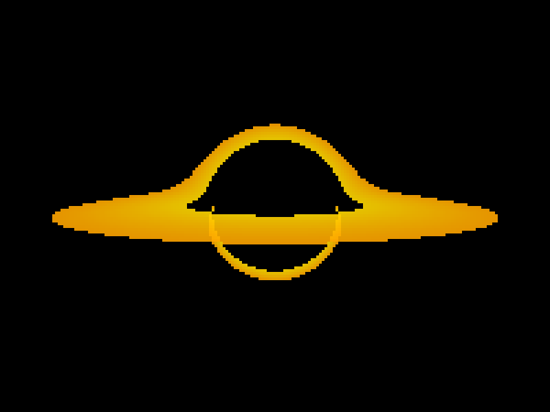
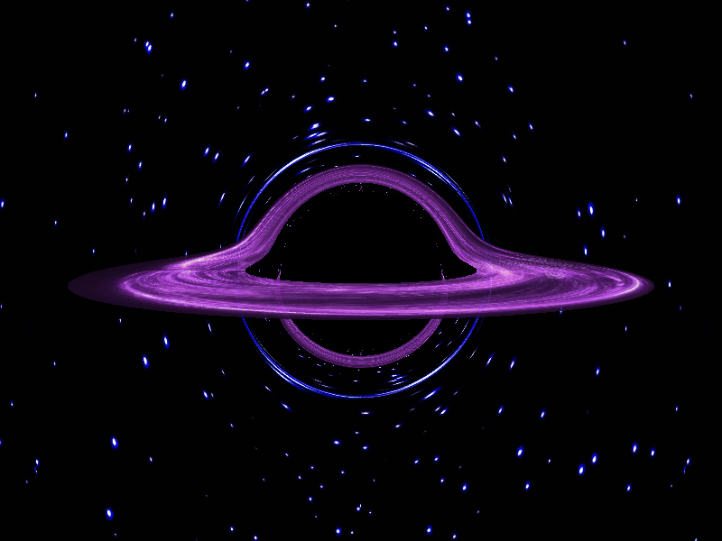

# Blackhole for poor people

[This guy](https://github.com/kavan010) made the same [here](https://youtu.be/8-B6ryuBkCM?si=FZ5Q98ncbUAoMxH_) in C++. It required GPU. I am poor and I don't have a GPU. So I made it in python to only use CPU to render it as an image (because I'm busy).

This was heavily inspired by [his project](https://github.com/kavan010/black_hole). I did change a little like using G=c=1 instead of real SI unit values to not anger the floating-point Gods, euler method instead of rk4(I think he did euler too). Rest math is same. Just run the script after installing the requirements... done! If you want fancier outputs, just add background and accertion disk images and link it to the main file.

Sample output:
<!--  -->

## My definitions:

**Ray Trace** - Tracing the ray bouncing, scattering on objects in straight lines, because light wants to travel the shortest distance, to cover a distance in the shortest distance possible light has to travel straight, and the rays are traced analytically.

**Ray March** - Same as ray tracing but the rays are traced on small short steps, numerically.

**Ray Warp** - Earlier I lied. Light should trace the shortest distance, yes. But sometimes the shortest distance might not be straight. To calculate the shortest path, comes geodesic equations, using which the rays are traced in short steps. This warps the light around objects in spacetime and the procedure to trace these rays, I call it **ray warping**. 

`nanba.py` is not a typo. 'Nanba' in the language tamil, means 'Friend'. So, numba helper functions = nanba.py.
